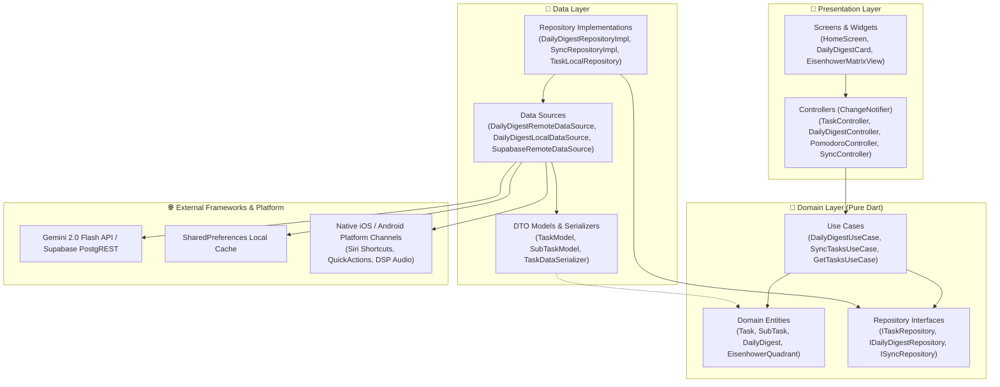

<div align="center">
  
  <h1>TodoApp</h1>
  <p>
    <strong>Executive-класс менеджер задач и персональный центр продуктивности на Flutter: AI Daily Digest (Gemini 2.0 Flash), Интерактивная Матрица Эйзенхауэра 2x2 (Drag-and-Drop), Нативные шорткаты Siri и Android (Deep Links), Pomodoro-таймер с аудиостудией DSP и Spotify, 120-дневный Heatmap, интерактивные виджеты iOS 17 и Offline-First синхронизация с Supabase</strong><br/>
    <em>An executive-grade cross-platform Flutter productivity suite featuring AI Daily Digest (Gemini 2.0 Flash), Interactive 2x2 Eisenhower Matrix (Drag-and-Drop), Native Siri & Android Shortcuts (Deep Link URI schemes), Focus Pomodoro timer with Spotify hub and procedural DSP audio, 120-day activity heatmap, iOS 17 interactive widgets, and resilient offline-first Supabase sync</em>
  </p>

  <p>
    <a href="#русский">Русский</a> •
    <a href="#english">English</a> •
    <a href="#скриншоты--screenshots">Скриншоты / Screenshots</a> •
    <a href="#портфолио-шоукейс-сценарии-для-демо--portfolio-showcase-scenarios">Шоукейс-сценарии / Showcase</a>
  </p>

  <p>
    
    
    
    
    
    
    
    
    
    <a href="LICENSE"></a>
  </p>
</div>

---

## Скриншоты / Screenshots

> Все скриншоты сделаны на симуляторе iOS (**iPhone 17**) с синхронизированным системным временем **`09:41`** и идеальным ретина-разрешением.  
> *All screenshots were captured on the iOS Simulator (**iPhone 17**) with a synchronized **`09:41`** status bar clock and native retina fidelity.*

<div align="center">
  <table>
    <tr>
      <td align="center" width="25%">
        <strong>AI Daily Digest & Задачи</strong><br/>
        <em>Smart Tasks & AI Brief</em><br/><br/>
        
      </td>
      <td align="center" width="25%">
        <strong>Таймер фокуса</strong><br/>
        <em>Pomodoro Focus Timer</em><br/><br/>
        
      </td>
      <td align="center" width="25%">
        <strong>Музыка и Аудио-микшер</strong><br/>
        <em>Focus Music Hub & Mixer</em><br/><br/>
        
      </td>
      <td align="center" width="25%">
        <strong>Дашборд продуктивности</strong><br/>
        <em>120-Day Activity Heatmap</em><br/><br/>
        
      </td>
    </tr>
    <tr>
      <td align="center" width="25%">
        <strong>Темы и языки</strong><br/>
        <em>Settings & Themes</em><br/><br/>
        
      </td>
      <td align="center" width="25%">
        <strong>Интерактивный онбординг</strong><br/>
        <em>Welcome Onboarding Flow</em><br/><br/>
        
      </td>
      <td align="center" width="25%">
        <strong>Авторизация Supabase</strong><br/>
        <em>Supabase OTP & Offline Auth</em><br/><br/>
        
      </td>
      <td align="center" width="25%">
        <strong>Иконка TodoApp</strong><br/>
        <em>Liquid Glass Icon</em><br/><br/>
        
      </td>
    </tr>
  </table>
</div>

---

## Русский

### О проекте

**TodoApp** — это инженерный флагманский проект на **Flutter 3.x / Dart 3.11+**, созданный по строгим канонам **Clean Architecture** с применением передовых паттернов мобильной разработки: реактивного управления состоянием, отказоустойчивой **Offline-First** синхронизации, интеграции с LLM (**Google Gemini 2.0 Flash**) и нативных интерфейсов iOS/Android.

В отличие от тривиальных to-do приложений, TodoApp спроектирован как персональный executive-центр: он формулирует утренние приоритеты с помощью ИИ, помогает стратегически распределять нагрузку через **Матрицу Эйзенхауэра 2x2 с Drag-and-Drop**, запускает фокусные спринты с процедурным генератором звуков концентрации (DSP) и управлением фоновой музыкой, поддерживает нативные голосовые команды **Siri / Google Assistant** и гарантирует сохранность данных даже в условиях нестабильного интернета.

---

### 🔥 Три ключевые фичи уровня «Next Level»

#### 1. 🤖 AI Daily Digest (Утренний бриф от ИИ)
- **Умная саммари-сводка на день**: При открытии приложения генерируется персонализированный бриф, анализирующий расписание, срочность и дедлайны.
- **Top-1 Фокус и слот продуктивности**: ИИ выделяет главную задачу дня и рекомендует оптимальное окно пиковой концентрации (*«10:00 – 12:30 (утренний пик энергии)»*, *«14:30 – 16:30 (глубокий фокус)»*).
- **Zero-Latency кэширование**: Результат сохраняется в `SharedPreferences` на 24 часа. При отсутствии задач отдаётся ободряющий стратегический бриф без лишних сетевых затрат.
- **Двухуровневый Fallback**: Если сеть недоступна или нет API-ключа, включается встроенный детерминированный эвристический NLP-движок (`HeuristicDigestGenerator`), гарантирующий 100% работоспособность офлайн.
- **UX/UI**: Неоморфная карточка с градиентным бейджем, плавной skeleton-shimmer анимацией при загрузке, возможностью ручного обновления и скрытия.

#### 2. 🗂️ Интерактивная Матрица Эйзенхауэра (Квадранты 2x2 с Drag-and-Drop)
- **Альтернативный режим отображения**: Переключатель в хедере мгновенно переводит экран задач из классического списка (`ListView`) в сетку 4 квадрантов:
  - **Q1: Срочно и Важно (Do)** — Горит, сделать прямо сейчас (`P1` 🔥)
  - **Q2: Не срочно, но Важно (Schedule)** — Стратегические цели, запланировать в календарь (`P2` ⚡)
  - **Q3: Срочно, но Не важно (Delegate)** — Рутина и внешние запросы, делегировать или упростить (`P3` 📌)
  - **Q4: Не срочно и Не важно (Eliminate)** — Поглотители времени, отложить или удалить (`P4` 🌿)
- **Тактильный Drag-and-Drop**: Полноценное перетаскивание задач между квадрантами через `LongPressDraggable` и `DragTarget`.
- **Автоматическая реклассификация**: При броске карточки в целевой квадрант автоматически обновляются флаги `isUrgent`, `isImportant` и сопоставленный приоритет задачи с мгновенной оптимистичной записью в локальную БД и облако.
- **Haptic Feedback**: Фирменный виброотклик iOS Taptic Engine при захвате и успешном перемещении задачи с возможностью быстрой отмены (`Undo SnackBar`).

#### 3. 🎙️ Нативные голосовые шорткаты и Deep Links (Siri & Google Assistant)
- **Глубокие ссылки (Deep Links)**: Поддержка URL-схемы `todo://`:
  - `todo://tasks/new?title=...&category=...&priority=...` — открытие формы создания задачи с предзаполненным текстом.
  - `todo://voice/quick` — моментальная активация микрофона и распознавание речи.
  - `todo://matrix` — прямой переход в режим Матрицы Эйзенхауэра.
  - `todo://focus` — мгновенный запуск сессии Pomodoro.
- **Native Quick Actions**:
  - **iOS**: Настройка `UIApplicationShortcutItems` и `CFBundleURLTypes` в `Info.plist` и маршрутизация в `AppDelegate.swift`.
  - **Android**: Статические шорткаты рабочего стола в `shortcuts.xml`, `strings.xml` и обработка интентов `ACTION_VIEW` в `MainActivity.kt`.
- **Голосовой ввод на бегу**: Распознавание речи через микрофон с живой транскрипцией и мгновенным разбором времени и дедлайнов.

---

### ✨ Дополнительные возможности экосистемы

- **🎧 Фокус-хаб и Аудиостудия**:
  - Музыкальный хаб для плейлистов **Spotify**, **Apple Music**, **Яндекс Музыка**, **YouTube Music**.
  - 6 процедурных DSP-генераторов атмосферного шума нативного уровня: *Дождь*, *Костер*, *Белый шум*, *Прибой*, *Уютное кафе*, *Винил*.
  - Управление воспроизведением со шторки и экрана блокировки (Now Playing Info Center).
- **⏱️ Кастомизируемый Pomodoro-таймер**: обратный отсчёт от 1 до 120 минут с автоматическим начислением статистики.
- **📊 120-дневный Heatmap продуктивности**: сетка активности в стиле GitHub за 4 месяца, круговая диаграмма распределения приоритетов и учёт серий (Streaks).
- **📱 Интерактивные виджеты iOS 17**: Swift/SwiftUI расширение для экрана «Домой» и экрана блокировки с поддержкой App Groups.
- **💾 Резервное копирование в изолятах**: экспорт всей базы задач в JSON, RFC 4180 CSV и Markdown без блокировки UI-потока.
- **☁️ Двусторонняя синхронизация Supabase**: Row Level Security (RLS), Last-Write-Wins разрешение конфликтов, флаг `isPendingSync` для гарантированной доставки при восстановлении соединения.
- **🎨 4 темы оформления**: Тёмная (Dark), Светлая (Light), Глубокая AMOLED (Midnight `#000000`) и Системная.
- **🌐 5 языков локализации**: Русский, English, Deutsch, Français, Српски.

---

### 🏛️ Архитектура Clean Architecture

Проект разделен на изолированные слабосвязанные слои с направлением зависимостей внутрь к Домену:



---

### 🎬 Портфолио-шоукейс: Сценарии для демо

Подробные пошаговые сценарии для записи видео-презентации или создания GIF-анимаций для портфолио:

#### Сценарий 1: AI Daily Digest & Голосовой ввод на бегу
> **Цель:** Продемонстрировать интеграцию современных LLM и бесшовный голосовой ввод задач.
1. **Запуск**: Открытие приложения. В верхней части экрана плавно отображается shimmer-скелетон, который через доли секунды сменяется стильной неоморфной карточкой `AI Daily Digest`.
2. **Анализ**: На карточке виден заголовок дня, бейдж `⚡ Главный фокус дня: Релиз мобильного клиента` и рекомендация временного окна `⏰ Лучший слот: 10:00 – 12:30`.
3. **Голосовой шорткат**: Долгий тап по иконке приложения на домашнем экране -> выбор системного шортката **«Голосовая задача»** (или диплинк `todo://voice/quick`).
4. **Диктовка**: Произносится фраза: *«Подготовить презентацию для инвесторов завтра к четырем часам срочно»*.
5. **Результат**: Офлайн-NLP мгновенно парсит голос в структурированную задачу с названием «Подготовить презентацию для инвесторов», приоритетом `P1 (Срочно)` и точным дедлайном.

#### Сценарий 2: Интерактивная Матрица Эйзенхауэра (Drag-and-Drop)
> **Цель:** Показать сложный интерактивный UI/UX с анимациями и виброоткликом.
1. **Переключение вида**: Нажатие на иконку сетки в AppBar (`Icons.grid_view_rounded`). Экран плавно переключается из списка в адаптивную 2x2 матрицу квадрантов.
2. **Оценка квадрантов**: Видны 4 цветовых сектора: Q1 (Красный - Сделай сейчас), Q2 (Оранжевый - Запланируй), Q3 (Фиолетовый - Делегируй), Q4 (Зеленый - Отложи).
3. **Drag-and-Drop**: Зажатие задачи из квадранта Q4 («Посмотреть вебинар»). Срабатывает тактильный щелчок Taptic Engine. Полупрозрачная карточка следует за пальцем.
4. **Дроп**: Карточка перетаскивается в Q1. Целевой квадрант подсвечивается неоновым свечением. При отпускании пальца раздается тяжелый тактильный отклик `AppHaptics.heavy()`.
5. **Реакция**: Задача мгновенно получает приоритет `P1`, счетчики квадрантов обновляются, внизу всплывает SnackBar с подтверждением и кнопкой «Отмена».

#### Сценарий 3: Offline-First Fault Tolerance & Двусторонняя облачная синхронизация
> **Цель:** Доказать сеньорный уровень проектирования сетевого взаимодействия и отказоустойчивости.
1. **Офлайн-режим**: Включение Авиарежима на устройстве.
2. **Действие**: Создание новой задачи и перемещение её по статусам. Приложение работает моментально без спиннеров и сетевых блокировок. Локальный флаг `isPendingSync` сохраняет транзакцию.
3. **Включение сети**: Отключение Авиарежима.
4. **Синхронизация**: Приложение выполняет фоновый синк через `SyncController`. В логах и статусе настроек фиксируется успешное слияние локальных данных с базой данных Supabase по алгоритму Last-Write-Wins (LWW).

---

### 🧪 Тестирование и Качество кода

Проект протестирован с полным покрытием ключевых бизнес-сценариев:

```bash
# Строгий статический анализ (0 warnings, 0 infos):
flutter analyze --fatal-infos

# Запуск полного набора unit- и widget-тестов (101 тест):
flutter test
```

- **101/101 тестов успешно проходят (`All tests passed!`)**.
- Тестовый набор покрывает:
  - `ai_digest_test.dart`: кэширование, эвристический генератор, логика контроллера дайджеста.
  - `eisenhower_matrix_test.dart`: маппинг квадрантов, смена приоритетов при драге, рендеринг виджета 2x2.
  - `deep_link_shortcuts_test.dart`: разбор параметров диплинков и предзаполнение полей формы.
  - `tasks_clean_architecture_test.dart`: отказоустойчивый синк, транзишены состояний `SyncController`, изоляция домена.
  - `tasks_test.dart`: сквозные виджет-тесты авторизации, календаря, таймера фокуса и архива.

---

## English

### Overview

**TodoApp** is an executive-grade, production-ready Flutter task manager and productivity workspace engineered under strict **Clean Architecture** principles. It pairs a dark Listodo design system with cutting-edge mobile technologies: LLM integration (**Google Gemini 2.0 Flash**), an interactive **2x2 Eisenhower Priority Matrix with Drag-and-Drop**, native **Siri & Google Assistant Shortcuts** (URL schemes), procedural audio synthesis (DSP), iOS 17 Interactive Widgets, and resilient **Offline-First Supabase synchronization**.

---

### 🚀 Killer Features

1. **AI Daily Digest (Morning Smart Brief)**:
   - Evaluates daily tasks, priorities, and deadlines to produce a concise 2-3 sentence strategic brief.
   - Identifies the single most impactful **Top-1 Focus** task and suggests an optimal productivity energy window (*"10:00 – 12:30 (Morning Energy Peak)"*).
   - 24-hour local caching with a zero-latency heuristic offline engine (`HeuristicDigestGenerator`) ensuring 100% functionality without internet connection.
   - Glassmorphic card design with smooth skeleton-shimmer loading and dismissible state.

2. **Interactive Eisenhower Matrix (2x2 Drag-and-Drop Grid)**:
   - Instant toggle between ListView and the 4 Eisenhower Quadrants (Q1: Do, Q2: Schedule, Q3: Delegate, Q4: Eliminate).
   - Tactile Drag-and-Drop using `LongPressDraggable` and `DragTarget` with native Taptic Engine feedback.
   - Automatic reclassification of task urgency, importance, and priority level upon drop.

3. **Native Voice & App Shortcuts (Siri & Assistant Deep Links)**:
   - Deep link schema `todo://tasks/new?title=...`, `todo://voice/quick`, `todo://matrix`, `todo://focus`.
   - Android `shortcuts.xml` and iOS `UIApplicationShortcutItems` for fast desktop interactions.
   - Real-time speech-to-text recognition with offline NLP timestamp parsing.

---

### 💻 Tech Stack

| Domain | Technology |
| :--- | :--- |
| **Framework & Language** | Flutter 3.x, Dart 3.11+ |
| **Architecture** | Feature-First Clean Architecture (`domain`, `data`, `presentation`) |
| **State Management** | `provider` (`ChangeNotifier`, `MultiProvider`) |
| **AI & NLP** | Google Gemini 2.0 Flash REST API + Local Heuristic NLP Parser |
| **Cloud & Auth** | Supabase PostgREST (Offline-First LWW), Supabase Email OTP & Local Auth |
| **Native Integrations** | Siri Shortcuts (`CFBundleURLTypes`), Android Shortcuts (`shortcuts.xml`), iOS 17 WidgetKit |
| **Audio Engine** | Procedural DSP Ambient Noise Engine (Rain, Fire, Waves, Cafe, Vinyl), Spotify Hub |
| **Testing** | `flutter_test`, `mocktail` (101 automated unit & widget tests, 100% green) |

---

### 📦 Quick Start

```bash
# 1. Clone repository
git clone https://github.com/helltrilla/todo.git
cd todo

# 2. Install dependencies
flutter pub get

# 3. Run analyzer and tests
flutter analyze --fatal-infos
flutter test

# 4. Launch on device / simulator
flutter run
```

---

<div align="center">
  <sub>Crafted with passion for engineering elegance, clean architecture, and delightful user experiences.</sub>
</div>
