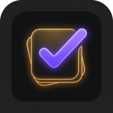
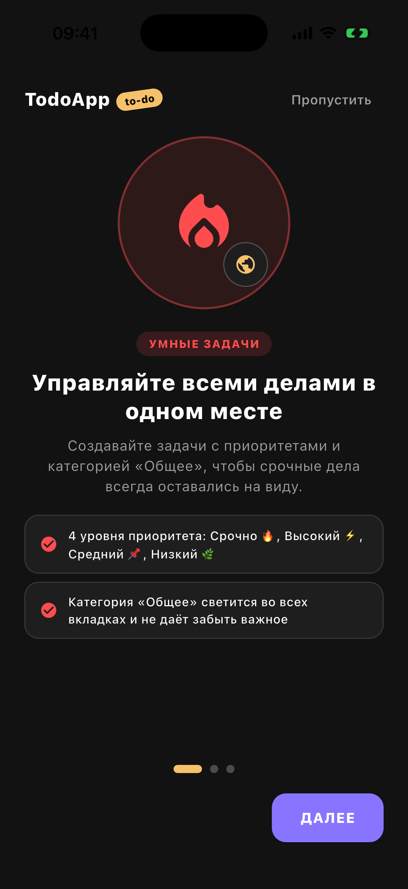
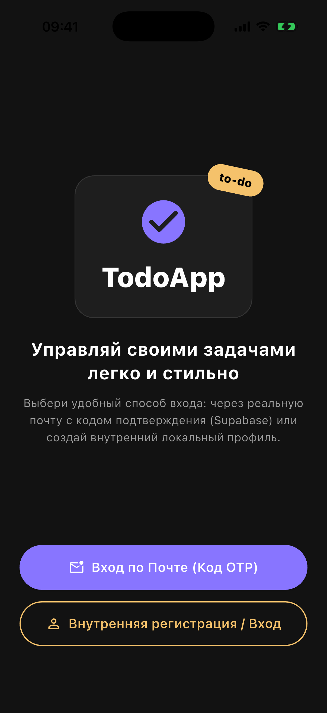
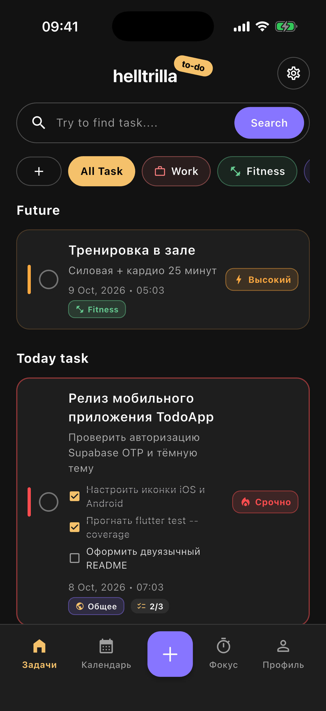
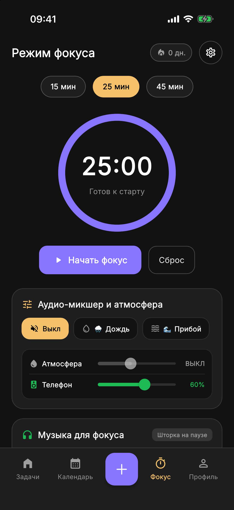
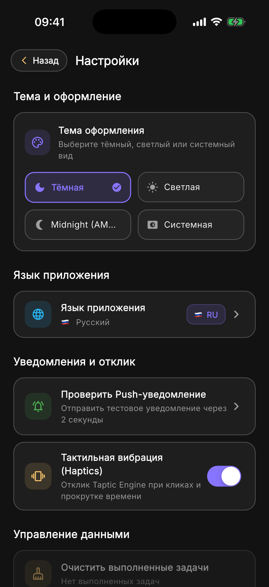

<div align="center">
  
  <h1>TodoApp</h1>
  <p>
    <strong>Современный менеджер задач с категориями, подзадачами, таймером фокуса, звуковой студией, темами, локализацией и авторизацией через Supabase OTP</strong><br/>
    <em>A modern Flutter task manager featuring custom categories, checklists, Pomodoro focus timer, ambient audio studio, themes, 5-language localization, and Supabase Email OTP auth</em>
  </p>

  <p>
    <a href="#русский">Русский</a> •
    <a href="#english">English</a> •
    <a href="#скриншоты--screenshots">Скриншоты / Screenshots</a>
  </p>

  <p>
    
    
    
    
    
    
    <a href="LICENSE"></a>
  </p>
</div>

---

## Скриншоты / Screenshots

> Все скриншоты сделаны на симуляторе iOS с синхронизированным системным временем **`09:41`**.  
> *All screenshots were captured on the iOS Simulator with a synchronized **`09:41`** status bar clock.*

<div align="center">
  <table>
    <tr>
      <td align="center" width="20%">
        <strong>Онбординг / Onboarding</strong><br/><br/>
        
      </td>
      <td align="center" width="20%">
        <strong>Авторизация / Welcome Auth</strong><br/><br/>
        
      </td>
      <td align="center" width="20%">
        <strong>Задачи / Tasks</strong><br/><br/>
        
      </td>
      <td align="center" width="20%">
        <strong>Студия фокуса / Focus Studio</strong><br/><br/>
        
      </td>
      <td align="center" width="20%">
        <strong>Темы и языки / Settings</strong><br/><br/>
        
      </td>
    </tr>
  </table>
</div>

---

## Русский

### О проекте

**TodoApp** — это кроссплатформенное приложение для управления задачами и личной продуктивностью на **Flutter**, разработанное в современной эстетике (по мотивам дизайн-системы *Listodo UI Kit*) и построенное по принципам **Feature-First Clean Architecture**.

Приложение объединяет продвинутый планировщик задач с подзадачами, настраиваемые категории с иконками и палитрами, iOS-календарь с барабанами точного выбора времени, Pomodoro-таймер с аппаратными генераторами атмосферных шумов и музыкальным плейлист-хабом, 4 темы оформления (включая глубокую AMOLED Midnight), локализацию на 5 языков и двухрежимную авторизацию (облачный вход через **Supabase Email OTP** или автономный локальный аккаунт).

---

### ✨ Ключевые возможности

- **🌐 Мультиязычная локализация (5 языков)**:
  - Полная поддержка 5 языков интерфейса: **🇷🇺 Русский**, **🇬🇧 English**, **🇩🇪 Deutsch**, **🇫🇷 Français** и **🇷🇸 Српски**.
  - Мгновенное переключение языка прямо в Настройках через шторку с флагами стран без необходимости перезапускать приложение.
  - Честная поддержка контекстных грамматических форм числительных для каждого языка (*1 задача, 2 задачи, 5 задач*).
  - Персистентное сохранение языка в `SharedPreferences` (`app_language_code`).

- **🎨 4 темы оформления интерфейса**:
  - **🌙 Тёмная (Dark)**: стильная фирменная палитра Listodo UI.
  - **☀️ Светлая (Light)**: яркий, контрастный и чистый дневной интерфейс.
  - **🖤 Midnight (AMOLED)**: ультраглубокий чёрный цвет (`#000000`) для экономии заряда аккумулятора на OLED/AMOLED дисплеях.
  - **⚙️ Системная (System)**: динамическое следование за системной темой iOS/Android.

- **🎧 Студия концентрации и эмбиент-шумы (Focus Audio Studio)**:
  - 4 встроенных аппаратных генератора атмосферных шумов для глубокой концентрации: **🌧️ Дождь**, **🌊 Океанский прибой**, **☕ Уютное кафе**, **💿 Виниловый проигрыватель**.
  - Двухканальный аудиомикшер с раздельными ползунками громкости для фоновой атмосферы и системного звука.
  - Музыкальный хаб с кастомными плейлистами пользователя (Spotify, Apple Music, Яндекс Музыка, YouTube Music, VK Музыка).
  - Автоматическое распознавание сервиса, загрузка превью-обложек по ссылке и возможность установки собственных артов из фотогалереи устройства.
  - Плавная интеграция с Пунктом управления и экраном блокировки iOS (Now Playing / Control Center) без задержек и подвисаний.

- **🚀 Интерактивный онбординг при первом запуске**:
  - 3 приветственных слайда с кастомной векторной графикой и анимацией, которые отображаются только при первой установке приложения.

- **🔐 Двухрежимная авторизация (Supabase + Офлайн)**:
  - **Вход по Email (OTP)**: отправка реального 6-значного одноразового кода подтверждения на электронную почту через **Supabase Auth REST API**.
  - **Локальный профиль**: мгновенная регистрация и вход по логину/паролю без интернета.

- **✅ Умные задачи и подзадачи (Чек-листы)**:
  - Интерактивные подзадачи внутри каждой задачи с возможностью отмечать чекбоксы прямо на карточке и живым индикатором прогресса (`2/3`).
  - Автоматическое завершение основной задачи при закрытии всех её подзадач.
  - Чёткое разделение на секции: **Future / Today task** и **Completed task today**.

- **🎨 Кастомные категории с иконками и цветами**:
  - Конструктор категорий: выбор из **12 тематических иконок** и **10 авторских цветовых палитр**.
  - Глобальная категория **«Общее»** с золотым акцентом — задачи из неё видны во всех категориях и всегда остаются в фокусе.

- **🔥 4 уровня приоритета**:
  - **P1 — Срочно 🔥** (красный акцент и выделенная рамка карточки)
  - **P2 — Высокий ⚡** (оранжевый акцент)
  - **P3 — Средний 📌** (фиолетовый акцент)
  - **P4 — Низкий 🌿** (зелёный акцент)

- **📅 Календарь и выбор времени в стиле iOS**:
  - Вкладка **«Календарь»** с горизонтальной недельной лентой и переключателем *Активные / Завершённые*.
  - Колеса прокрутки времени (`CupertinoPicker`) для часов (`00–23`) и минут (`00–59`).

- **⏱️ Pomodoro-таймер**:
  - Круговой индикатор обратного отсчёта, быстрые пресеты на `15`, `25`, `45` и `60` минут, статистика завершённых сессий.

- **📦 Свайп-жесты и Архив задач**:
  - **Свайп влево** — мгновенное удаление с возможностью отмены (`SnackBar`).
  - **Свайп вправо** по выполненной задаче — перенос в **Архив** с возможностью просмотра, восстановления или полной очистки.

---

### 🏗️ Архитектура и технический стек

Проект реализован по методологии **Feature-First Clean Architecture** с разделением слоёв на `domain`, `data` и `presentation`, и функциональной обработкой ошибок через монаду `Result<T>` (`Success<T>` / `Error<T>`).

```text
lib/
├── core/
│   ├── app_router/       # Навигация GoRouter и защитные гварды (Auth & Onboarding guards)
│   ├── app_theme/        # Управление темами (Dark, Light, Midnight, System) и ThemeController
│   ├── localization/     # Локализация на 5 языков (RU, EN, DE, FR, SR) и LocaleController
│   ├── config/           # Конфигурация окружения и ключей Supabase
│   ├── haptics/          # Тактильная отдача Haptics (iOS Taptic Engine)
│   ├── notifications/    # Локальные уведомления и обработка Quick Actions
│   └── errors/           # Базовые классы Failure и монада Result<T>
├── features/
│   ├── auth/             # Модуль авторизации, онбординга, профиля и экрана настроек
│   │   ├── domain/       # Сущность AppUser и контракт IAuthRepository
│   │   ├── data/         # AuthRepositoryImpl (Supabase REST API + SharedPreferences)
│   │   └── presentation/ # AuthController, Onboarding, Welcome, EmailOtp, InternalAuth, SettingsScreen
│   └── tasks/            # Модуль задач, категорий, календаря, таймера и аудиостудии фокуса
│       ├── domain/       # Модели Task, SubTask, PriorityLevel, TaskCategoryStyle, ITaskRepository
│       ├── data/         # TaskLocalRepository (локальная персистентность JSON)
│       └── presentation/ # TaskController, HomeScreen, CalendarTabView, FocusTabView, ProfileTabView
└── main.dart             # Точка входа, регистрация делегатов локализации и ChangeNotifierProvider
```

| Категория | Технологии |
| :--- | :--- |
| **Фреймворк и язык** | Flutter 3.x, Dart 3.11+ |
| **Управление состоянием** | `provider` (`ChangeNotifier`, `MultiProvider`) |
| **Навигация** | `go_router` |
| **Локализация** | `flutter_localizations` (5 языков: ru, en, de, fr, sr) |
| **Темы оформления** | `ThemeData` (Dark, Light, Midnight AMOLED `#000000`, System) |
| **Бэкенд и авторизация** | Supabase Auth REST API (`http`) + Local Auth |
| **Локальное хранилище** | `shared_preferences` |
| **Тактильный отклик** | `AppHaptics` (`HapticFeedback`) |
| **Тестирование** | `flutter_test`, `mocktail` |

---

### 🚀 Установка и запуск

1. **Клонируйте репозиторий:**
   ```bash
   git clone https://github.com/helltrilla/todo.git
   cd todo
   ```

2. **Установите зависимости:**
   ```bash
   flutter pub get
   ```

3. **Запустите приложение:**
   ```bash
   flutter run
   ```
   > При необходимости можно передать собственные ключи Supabase через `--dart-define`:
   > ```bash
   > flutter run \
   >   --dart-define=SUPABASE_URL=https://your-project.supabase.co \
   >   --dart-define=SUPABASE_ANON_KEY=your-anon-key
   > ```

4. **Проверка анализатора и тесты:**
   ```bash
   flutter analyze --fatal-infos
   flutter test --coverage
   ```

---

## English

### Overview

**TodoApp** is a modern cross-platform productivity and task management app engineered with **Flutter**, crafted around the aesthetic *Listodo UI Kit* design language and built upon **Feature-First Clean Architecture**.

It pairs structured checklists and subtasks, customizable categories with vibrant palettes and icons, an iOS-style scroll-wheel date & time picker, a daily calendar strip, a Pomodoro focus timer with built-in procedural ambient noise generators and custom playlist hubs, 4 theme modes (including AMOLED Midnight), instant localization in 5 languages, and dual-mode authentication (cloud-verified **Supabase Email OTP** or offline local credentials).

---

### ✨ Key Features

- **🌐 Multi-Language Localization (5 Locales)**:
  - First-class support for **🇷🇺 Russian**, **🇬🇧 English**, **🇩🇪 German**, **🇫🇷 French**, and **🇷🇸 Serbian**.
  - Dynamic runtime language switching via an interactive bottom sheet with country flag badges — no app restart needed.
  - Native pluralization rules tailored for each language (*1 task, 2 tasks, 5 tasks*).
  - Persisted securely across sessions in `SharedPreferences` (`app_language_code`).

- **🎨 4 Theme Modes**:
  - **🌙 Dark**: Listodo signature dark aesthetic.
  - **☀️ Light**: High-contrast, crisp daylight theme.
  - **🖤 Midnight (AMOLED)**: Ultra-deep `#000000` pitch black designed to conserve battery on OLED displays.
  - **⚙️ System**: Seamlessly adapts to iOS / Android device brightness settings.

- **🎧 Focus Ambient Studio & Music Hub**:
  - 4 procedural ambient soundscapes to elevate focus: **🌧️ Rain**, **🌊 Ocean Waves**, **☕ Cozy Cafe**, **💿 Vinyl Player**.
  - Dual-channel audio mixer with granular sliders for ambient audio level and system volume.
  - User playlist hub (Spotify, Apple Music, Yandex Music, YouTube Music, VK Music).
  - Smart automatic cover fetching by URL with support for custom artwork uploads from the device gallery.
  - Zero-latency integration with iOS lock screen and Control Center media playback controls (Now Playing).

- **🚀 First-Launch Interactive Onboarding**:
  - 3 illustrated onboarding slides displayed only during the initial app launch.

- **🔐 Dual Authentication (Supabase + Offline Local Auth)**:
  - **Email OTP Sign-In**: Sends a genuine 6-digit one-time passcode via the **Supabase Auth REST API**.
  - **Internal Offline Sign-In**: Instant local authentication persisted on the device for completely offline workflows.

- **✅ Smart Tasks & Interactive Checklists**:
  - Multi-item subtask checklists toggleable right from the task cards with a live completion counter (`2/3`).
  - Automatic parent task completion when all associated subtasks are finished.
  - Clean visual separation into **Future / Today task** and **Completed task today**.

- **🎨 Custom Categories with Icons & Color Palettes**:
  - Category creator with **12 curated icons** and **10 vivid color schemes**.
  - Universal **«General»** category with a golden badge visible across all tab filters.

- **🔥 4 Visual Priority Levels**:
  - **P1 — Urgent 🔥** (Red accent & highlighted card borders)
  - **P2 — High ⚡** (Orange accent)
  - **P3 — Medium 📌** (Purple accent)
  - **P4 — Low 🌿** (Green accent)

- **📅 iOS-Style Calendar & Time Wheels**:
  - Dedicated **Calendar** tab with a horizontal week selector and *Active / Completed* filter tabs.
  - Dual `CupertinoPicker` scroll wheels for hours (`00–23`) and minutes (`00–59`).

- **⏱️ Focus Mode (Pomodoro Timer)**:
  - Circular progress ring, quick presets for `15`, `25`, `45`, and `60` minutes, and completed session tracker.

- **📦 Swipe Gestures & Task Archive**:
  - **Swipe Left** to delete a task card (with undo `SnackBar`).
  - **Swipe Right** on completed tasks to move them into the **Archive**, with full restore or permanent wipe options.

---

### 🛠️ Getting Started

1. **Clone the repository:**
   ```bash
   git clone https://github.com/helltrilla/todo.git
   cd todo
   ```

2. **Install dependencies:**
   ```bash
   flutter pub get
   ```

3. **Run the app:**
   ```bash
   flutter run
   ```

4. **Run static analysis and tests:**
   ```bash
   flutter analyze --fatal-infos
   flutter test --coverage
   ```

---

## 📬 Используете проект? / Using This Project?

Если вы используете этот проект или его части в своём приложении, стартапе или продукте — черканите мне:  
*If you use this project or parts of it in your app, startup, or product — feel free to drop me a line:*

- 📧 **Почта / Email**: [helltrilla66@gmail.com](mailto:helltrilla66@gmail.com)
- 💬 **Telegram**: [@helltrilla66](https://t.me/helltrilla66)

Мне безумно интересно посмотреть, как проект живет в реальном мире, и я с радостью добавлю ваше приложение в секцию «Showcase»!  
*I'd love to see how this project lives in the real world and will gladly feature your app in a "Showcase" section!*

---

## 🔒 Политика конфиденциальности / Privacy Policy

Условия хранения данных, работы авторизации и удаления аккаунта описаны в документе [PRIVACY_POLICY.md](PRIVACY_POLICY.md).  
*Data storage, authentication details, and account deletion instructions are documented in [PRIVACY_POLICY.md](PRIVACY_POLICY.md).*

---

## 📄 Лицензия / License

Проект распространяется под открытой лицензией **MIT** — подробности в файле [LICENSE](LICENSE).  
Лицензия MIT разрешает свободное коммерческое использование, модификацию, интеграцию в закрытые решения и перепродажу без каких-либо роялти и ограничений.

*This project is licensed under the **MIT License** — see the [LICENSE](LICENSE) file for details.*
