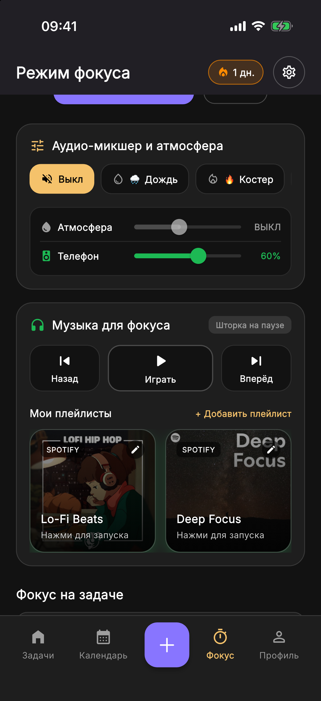
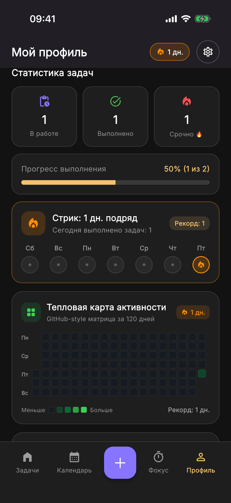

<div align="center">
  
  <h1>TodoApp</h1>
  <p>
    <strong>Современный кроссплатформенный менеджер задач (iOS, Android, Web) с категориями, подзадачами, таймером фокуса, музыкальным Spotify-хабом, звуковой студией, дашбордом продуктивности с матрицей 120 дней, интерактивными iOS 17 виджетами, голосовым вводом с офлайн-NLP, темами, локализацией и Supabase синхронизацией</strong><br/>
    <em>A modern cross-platform Flutter task manager (iOS, Android, Web PWA) featuring custom categories, checklists, Pomodoro focus timer, Spotify playlist hub, procedural ambient audio studio, 120-day productivity heatmap, interactive iOS 17 widgets, speech-to-text NLP, 4 themes, 5 locales, and offline-first Supabase sync</em>
  </p>

  <p>
    <a href="#русский">Русский</a> •
    <a href="#english">English</a> •
    <a href="#скриншоты--screenshots">Скриншоты / Screenshots</a>
  </p>

  <p>
    
    
    
    
    
    
    
    
    
    <a href="LICENSE"></a>
  </p>
</div>

---

## Скриншоты / Screenshots

> Все скриншоты сделаны на реальном симуляторе iOS (**iPhone 17**) с синхронизированным системным временем **`09:41`** и идеальным ретина-разрешением.  
> *All screenshots were captured on the iOS Simulator (**iPhone 17**) with a synchronized **`09:41`** status bar clock and native retina fidelity.*

<div align="center">
  <table>
    <tr>
      <td align="center" width="25%">
        <strong>Задачи и чек-листы</strong><br/>
        <em>Smart Tasks & Checklists</em><br/><br/>
        
      </td>
      <td align="center" width="25%">
        <strong>Таймер фокуса</strong><br/>
        <em>Pomodoro Focus Timer</em><br/><br/>
        
      </td>
      <td align="center" width="25%">
        <strong>Музыка и Аудио-микшер</strong><br/>
        <em>Focus Music Hub & Mixer</em><br/><br/>
        
      </td>
      <td align="center" width="25%">
        <strong>Дашборд продуктивности</strong><br/>
        <em>120-Day Activity Heatmap</em><br/><br/>
        
      </td>
    </tr>
    <tr>
      <td align="center" width="25%">
        <strong>Темы и языки</strong><br/>
        <em>Settings & Themes</em><br/><br/>
        
      </td>
      <td align="center" width="25%">
        <strong>Интерактивный онбординг</strong><br/>
        <em>Welcome Onboarding Flow</em><br/><br/>
        
      </td>
      <td align="center" width="25%">
        <strong>Авторизация Supabase</strong><br/>
        <em>Supabase OTP & Offline Auth</em><br/><br/>
        
      </td>
      <td align="center" width="25%">
        <strong>Иконка TodoApp</strong><br/>
        <em>Liquid Glass Icon</em><br/><br/>
        
      </td>
    </tr>
  </table>
</div>

---

## Русский

### О проекте

**TodoApp** — это бескомпромиссный кроссплатформенный менеджер задач и персональный центр личной продуктивности на **Flutter**, спроектированный в современной тёмной эстетике (по мотивам дизайн-системы *Listodo UI Kit*) и построенный по канонам **Feature-First Clean Architecture**.

Приложение объединяет структурированный трекинг задач с вложенными подзадачами, кастомные категории с авторскими цветовыми палитрами, Pomodoro-таймер с настраиваемой длительностью от 1 до 120 минут, **музыкальный хаб плейлистов (Spotify, Apple Music)**, 6 процедурных атмосферных звуковых генераторов (шум дождя, волн, костра, винила), **дашборд продуктивности с 120-дневной матрицей активности в стиле GitHub**, интерактивные виджеты iOS 17 для экрана «Домой» и экрана блокировки, быстрый экспорт бэкапа в изолятах (JSON, RFC 4180 CSV, Markdown), умный голосовой ввод с офлайн-NLP, 4 темы оформления (включая глубокую AMOLED Midnight), локализацию на 5 языков, двухрежимную авторизацию (**Supabase Email OTP** + локальный автономный аккаунт) и офлайн-first облачную синхронизацию задач.

---

### ✨ Ключевые возможности

- **🎧 Музыкальный плейлист-хаб и Аудиостудия фокуса (Focus Music Hub & Audio Studio)**:
  - **🎵 Музыкальный хаб стримингов**:
    - Интеграция с крупнейшими сервисами: **Spotify**, **Apple Music**, **Яндекс Музыка**, **YouTube Music** и **VK Музыка**.
    - Карточки плейлистов с превью-обложками, фирменными бейджами и цветовыми градиентами.
    - Встроенные готовые пресеты: *Lo-Fi Beats*, *Deep Focus*, *Synthwave Chill*, *Peaceful Piano*.
    - Автоматическая загрузка обложек по ссылке (через Spotify oEmbed API) и возможность добавления собственных плейлистов с пользовательскими артами из галереи устройства.
  - **🎛️ Двухканальный аудиомикшер**:
    - 6 встроенных процедурных генераторов фонового шума для глубокой концентрации: **🌧️ Дождь**, **🔥 Костер**, **💨 Белый шум**, **🌊 Прибой**, **☕ Уютное кафе**, **💿 Винил**.
    - Раздельные ползунки громкости для фоновой атмосферы и системного звука телефона прямо на карточке фокуса.
  - **⏯️ Тактильный пульт управления медиа (Now Playing)**:
    - Полноценные кнопки управления треками (*Назад*, *Играть / Пауза*, *Вперёд*) с живым индикатором состояния («Играет на шторке» / «Шторка на паузе»).
    - Полная поддержка дистанционного управления из Пункта управления iOS (Control Center) и с экрана блокировки без задержек.
  - **⏱️ Кастомизируемый Pomodoro-таймер**:
    - Плавный круговой индикатор обратного отсчёта времени (с возможностью тапа для быстрой настройки).
    - Быстрые чипы длительности (`15`, `25`, `45`, `60` мин), а также гибкий выбор любого времени от `1` до `120` минут со слайдером, кнопками точного шага `+5` / `-5` мин и персистентным сохранением в памяти.
    - Привязка фокус-сессии к конкретной задаче с автоматическим начислением выполненных помидорок (🍅) и учётом минут.

- **📊 Дашборд продуктивности и аналитика (Productivity Dashboard & 120-Day Heatmap)**:
  - **🟩 120-дневная тепловая матрица активности (GitHub-Style)**: наглядная сетка выполненных задач за последние 4 месяца с 4 градациями интенсивности выполнения и возможностью выбора любого дня для инспекции.
  - **🍩 Круговая диаграмма распределения (Donut Chart)**: детальный срез задач по уровням приоритета (Срочно, Высокий, Средний, Низкий) и категориям с расчетом процента успешности.
  - **🔥 Серия продуктивности (Streak Tracker)**: отображение текущей непрерывной серии дней, недельной полосы активности и фиксация персонального рекорда.
  - **🍅 Инфографика концентрации**: подсчет общего числа фокус-сессий, минут за сегодня, за неделю и за всё время.

- **🎙️ Голосовой ввод с офлайн-NLP и Gemini AI (Smart Voice Input)**:
  - Распознавание речи через микрофон с живой транскрипцией текста в реальном времени.
  - Двухуровневый интеллектуальный парсинг: мгновенный офлайн-парсер (детерминированное извлечение названия задачи, времени, относительных дедлайнов вроде *«завтра в 18:00»* и уровня приоритета *«срочно»*) плюс поддержка облачного Gemini Flash API для сложного контекста.

- **📱 Интерактивные виджеты для iOS 17 (Interactive WidgetKit & App Groups)**:
  - Нативные виджеты для домашнего экрана и экрана блокировки, написанные на Swift / SwiftUI (`ios/TodoWidget`).
  - Общий доступ к данным между приложением и расширением через App Groups (`group.com.helltrilla.todoapp`).
  - Интерактивные кнопки для мгновенной отметки выполнения задач и запуска фокуса прямо с рабочего стола без открытия приложения.

- **💾 Экспорт и резервное копирование данных в изолятах (Isolate Data Backup)**:
  - Неблокирующая фоновая сериализация всей базы задач в отдельных Dart Isolate-потоках без фризов UI даже на тысячах записей.
  - Поддержка экспорта в 3 формата:
    - **JSON**: полный снимок данных с метаинформацией, подзадачами и сессиями фокуса.
    - **CSV (RFC 4180)**: табличный формат для импорта в Excel, Google Sheets или Notion.
    - **Markdown**: красиво отформатированный список с чек-боксами для Obsidian, Logseq или GitHub.
  - Мгновенный вызов нативного системного меню «Поделиться» (Share Sheet) для отправки в Telegram, сохранение в Файлы или AirDrop.

- **☁️ Двусторонняя облачная синхронизация (Supabase Cloud Sync / Offline-First)**:
  - **Offline-First архитектура**: все операции с задачами выполняются в локальном кэше мгновенно с нулевой задержкой.
  - **Фоновая двусторонняя синхронизация**: автоматическая синхронизация с удаленной таблицей `tasks` в Supabase PostgREST при загрузке приложения или через **Pull-to-refresh** (потяните список задач вниз).
  - **Разрешение конфликтов Last-Write-Wins (LWW)**: слияние локальных и облачных изменений на основе миллисекундных таймстемпов `updatedAt`.
  - **Строгая изоляция данных (Row Level Security / RLS)**: каждый пользователь видит и редактирует только свои задачи благодаря политикам PostgreSQL (`auth.uid() = user_id`).
  - **Интерактивный статус синхронизации**: специальная карточка в Настройках с бейджем состояния (*Синхронизировано / В процессе / Офлайн*), временем последней синхронизации и кнопкой принудительного обновления «Синхронизировать сейчас».

- **🎨 4 темы оформления интерфейса**:
  - **🌙 Тёмная (Dark)**: стильная фирменная палитра Listodo UI.
  - **☀️ Светлая (Light)**: яркий, контрастный и чистый дневной интерфейс.
  - **🖤 Midnight (AMOLED)**: ультраглубокий чёрный цвет (`#000000`) для максимальной экономии заряда аккумулятора на OLED/AMOLED дисплеях.
  - **⚙️ Системная (System)**: динамическое следование за системной темой устройства.

- **🌐 Мультиязычная локализация (5 языков)**:
  - Полная поддержка 5 языков интерфейса: **🇷🇺 Русский**, **🇬🇧 English**, **🇩🇪 Deutsch**, **🇫🇷 Français** и **🇷🇸 Српски**.
  - Мгновенное переключение языка прямо в Настройках через шторку с флагами стран без перезапуска приложения.
  - Контекстные грамматические формы числительных (*1 задача, 2 задачи, 5 задач*).

- **✅ Умные задачи и подзадачи (Чек-листы)**:
  - Интерактивные подзадачи внутри каждой задачи с возможностью отмечать чекбоксы прямо на карточке и живым индикатором прогресса (`2/3`).
  - Автоматическое завершение основной задачи при закрытии всех её подзадач.
  - Разделение на секции: **Future / Today task** и **Completed task today**.

- **🎨 Кастомные категории и уровни приоритета**:
  - Конструктор категорий: выбор из **12 тематических иконок** и **10 авторских цветовых палитр**.
  - Глобальная категория **«Общее»** с золотым акцентом — видна во всех вкладках.
  - 4 уровня приоритета: **P1 — Срочно 🔥**, **P2 — Высокий ⚡**, **P3 — Средний 📌**, **P4 — Низкий 🌿**.

- **📦 Свайп-жесты и Архив задач**:
  - **Свайп влево** — быстрое удаление с возможностью отмены (`SnackBar`).
  - **Свайп вправо** по выполненной задаче — перенос в **Архив** с возможностью поиска, восстановления или полной очистки.

---

### 🏗️ Архитектура и технический стек

Проект реализован по методологии **Feature-First Clean Architecture** с разделением слоёв на `domain`, `data` и `presentation`, и функциональной обработкой ошибок через монаду `Result<T>` (`Success<T>` / `Error<T>`).

```text
lib/
├── core/
│   ├── app_router/          # Навигация GoRouter и защитные гварды авторизации
│   ├── app_theme/           # Управление 4 темами (Dark, Light, Midnight, System)
│   ├── localization/        # Локализация на 5 языков (RU, EN, DE, FR, SR)
│   ├── config/              # Конфигурация Supabase и окружения
│   ├── haptics/             # Тактильная отдача Haptics (iOS Taptic Engine)
│   ├── notifications/       # Локальные уведомления и обработка Quick Actions
│   └── errors/              # Монада Result<T> и базовые ошибки Failure
├── features/
│   ├── auth/                # Авторизация Supabase Email OTP, локальный вход, настройки
│   ├── backup/              # Isolate-экспорт задач в JSON, RFC 4180 CSV, Markdown
│   ├── productivity/        # 120-дневная матрица GitHub Heatmap, Donut Chart, стрики
│   ├── widgets/             # Синхронизация данных виджетов iOS 17 через App Groups
│   └── tasks/               # Модуль задач, категорий, календаря, таймера и Spotify-хаба
│       ├── domain/          # Сущности Task, SubTask, SmartTaskParser, ITaskRepository
│       ├── data/            # Local SQLite/Prefs, Remote Supabase, Offline-First Sync
│       └── presentation/    # HomeScreen, FocusTabView (Spotify + DSP), ProfileTabView
├── main.dart                # Точка входа приложения
ios/
└── TodoWidget/              # Нативное WidgetKit расширение на SwiftUI для iOS 17
supabase/
├── schema.sql               # DDL скрипт PostgreSQL с таблицей tasks, индексами и RLS
└── README.md                # Инструкция по развертыванию бэкенда
```

| Категория | Технологии |
| :--- | :--- |
| **Фреймворк и язык** | Flutter 3.x, Dart 3.11+ |
| **Управление состоянием** | `provider` (`ChangeNotifier`, `MultiProvider`) |
| **Навигация** | `go_router` |
| **Локализация** | `flutter_localizations` (5 языков: ru, en, de, fr, sr) |
| **Темы оформления** | `ThemeData` (Dark, Light, Midnight AMOLED `#000000`, System) |
| **Аудио и медиа** | Procedural DSP Audio Engine, iOS Lock Screen Controls, Spotify oEmbed |
| **Виджеты** | iOS 17 WidgetKit, App Groups (`group.com.helltrilla.todoapp`), SwiftUI |
| **Голос и NLP** | `speech_to_text`, Offline Natural Language Parser, Gemini Flash API |
| **Резервное копирование** | Dart Isolates, JSON, RFC 4180 CSV, Markdown, Native Share Sheet |
| **Аналитика продуктивности** | 120-Day GitHub-style Heatmap, Canvas CustomPainter Donut Chart |
| **Бэкенд и авторизация** | Supabase Auth REST API (`http`) + Local Auth |
| **Облачная синхронизация**| Supabase PostgREST, Row Level Security (RLS), Offline-First LWW |
| **Локальное хранилище** | `shared_preferences` |
| **Тактильный отклик** | `AppHaptics` (`HapticFeedback`) |
| **Тестирование** | `flutter_test`, `mocktail` (100% прохождение 71 теста) |

---

### 🚀 Установка и запуск

1. **Клонируйте репозиторий:**
   ```bash
   git clone https://github.com/helltrilla/todo.git
   cd todo
   ```

2. **Установите зависимости:**
   ```bash
   flutter pub get
   ```

3. **Настройте базу данных Supabase (для облачной синхронизации):**
   - Откройте проект в консоли [Supabase Dashboard](https://supabase.com/dashboard) -> **SQL Editor**.
   - Скопируйте и выполните скрипт [`supabase/schema.sql`](supabase/schema.sql) (создает таблицу `tasks`, индексы и политики RLS).
   - Подробнее в руководстве [`supabase/README.md`](supabase/README.md).

4. **Запустите приложение:**
   ```bash
   # Запуск на iPhone / Android устройстве или симуляторе:
   flutter run

   # Запуск веб-версии в браузере Chrome:
   flutter run -d chrome
   ```
   > При необходимости можно передать собственные ключи Supabase через `--dart-define`:
   > ```bash
   > flutter run \
   >   --dart-define=SUPABASE_URL=https://your-project.supabase.co \
   >   --dart-define=SUPABASE_ANON_KEY=your-anon-key
   > ```

5. **Сборка веб-версии (PWA):**
   ```bash
   flutter build web --release
   ```

6. **Проверка анализатора и тесты:**
   ```bash
   flutter analyze --fatal-infos
   flutter test --coverage
   ```

---

## English

### Overview

**TodoApp** is an uncompromising cross-platform task manager and personal productivity hub engineered with **Flutter**, crafted around the modern dark aesthetic of the *Listodo UI Kit* design language and built strictly upon **Feature-First Clean Architecture**.

It pairs structured checklists and subtasks, customizable categories with vibrant palettes and icons, an iOS-style scroll-wheel date & time picker, a daily calendar strip, a customizable Pomodoro focus timer (1 to 120 minutes), a **curated music playlist hub (Spotify, Apple Music)**, 6 procedural ambient noise generators, a **120-day GitHub-style productivity activity heatmap**, interactive iOS 17 Home & Lock Screen widgets, fast isolate-based multi-format backup exports (JSON, RFC 4180 CSV, Markdown), smart speech-to-text with offline NLP, 4 theme modes (including AMOLED Midnight), instant localization in 5 languages, dual-mode authentication (cloud-verified **Supabase Email OTP** or offline local credentials), and offline-first cloud task synchronization.

---

### ✨ Key Features

- **🎧 Focus Music Hub & Procedural Ambient Audio Studio**:
  - **🎵 Curated Streaming Music Hub**:
    - Seamless integration with top streaming platforms: **Spotify**, **Apple Music**, **Yandex Music**, **YouTube Music**, and **VK Music**.
    - Rich playlist cover cards with service badges, subtle gradient accents, and live cover art.
    - Out-of-the-box curated focus presets: *Lo-Fi Beats*, *Deep Focus*, *Synthwave Chill*, *Peaceful Piano*.
    - Automatic cover fetching via Spotify oEmbed API and custom playlist additions with photos from the device gallery.
  - **🎛️ Dual-Channel Audio Mixer**:
    - 6 built-in procedural ambient sound generators: **🌧️ Rain**, **🔥 Campfire**, **💨 White Noise**, **🌊 Ocean Waves**, **☕ Cozy Cafe**, **💿 Vinyl Player**.
    - Granular volume sliders for background soundscapes and system phone audio side-by-side.
  - **⏯️ Tactile Now Playing Transport Deck**:
    - Full playback transport buttons (*Previous*, *Play / Pause*, *Next*) with a live state indicator (*"Playing on lock screen"* / *"Paused"*).
    - Flawless zero-latency integration with the iOS Control Center and Lock Screen media controls.
  - **⏱️ Highly Customizable Pomodoro Timer**:
    - Circular progress countdown ring with tap-to-adjust gesture.
    - Quick duration chips (`15`, `25`, `45`, `60` min) and granular slider controls from `1` to `120` minutes with `+5` / `-5` step buttons and persistent storage.
    - Session tracking tied directly to active tasks with accumulated tomato badges (🍅) and focus minute counters.

- **📊 Productivity Dashboard & 120-Day Heatmap**:
  - **🟩 120-Day GitHub-Style Activity Matrix**: visualizes task completion over the last 4 months with 4 intensity levels and interactive day selection.
  - **🍩 Priority & Category Donut Chart**: visual breakdown of completed tasks by priority level (Urgent, High, Medium, Low) and category tags with live completion ratios.
  - **🔥 Streak Tracker**: monitors active daily streak, 7-day progress strip, and historical personal records.
  - **🍅 Focus Time Analytics**: total Pomodoro sessions, today's focus minutes, weekly focus time, and lifetime stats.

- **🎙️ Speech-to-Text with Offline NLP & Gemini AI**:
  - Real-time microphone speech recognition with live transcription.
  - Dual-layer parsing engine: instantaneous deterministic offline NLP (extracts title, time, relative deadlines like *"tomorrow at 6 PM"*, and priority markers like *"urgent"*) + optional Gemini Flash API for complex queries.

- **📱 Interactive iOS 17 Widgets (WidgetKit & App Groups)**:
  - Native Home Screen and Lock Screen widgets crafted in Swift / SwiftUI (`ios/TodoWidget`).
  - Seamless data sharing via Apple App Groups (`group.com.helltrilla.todoapp`).
  - Interactive buttons to mark tasks as done and launch the focus timer directly from the home screen without opening the app.

- **💾 Isolate-Based Backup & Export**:
  - Background serialization in independent Dart Isolates ensuring 60 FPS UI responsiveness even across thousands of records.
  - 3 export formats:
    - **JSON**: complete backup snapshot with metadata, checklists, and focus history.
    - **RFC 4180 CSV**: tabular format ready for Excel, Google Sheets, or Notion.
    - **Markdown**: formatted checklist document for Obsidian, Logseq, or GitHub.
  - Native iOS / Android Share Sheet invocation for one-tap AirDrop, Telegram, or Files storage.

- **☁️ Two-Way Offline-First Cloud Sync (Supabase PostgREST)**:
  - **Zero-Latency Local Execution**: All mutations (create, edit, toggle, delete) take effect locally without UI blocking.
  - **Automatic Background Synchronization**: Synchronizes with the remote `tasks` table on app launch, on demand via **Pull-to-Refresh**, or from Settings.
  - **Last-Write-Wins (LWW) Conflict Resolution**: Deterministic reconciliation between device and cloud models based on millisecond `updatedAt` timestamps.
  - **Row Level Security (RLS)**: Strict PostgreSQL security policies isolate data so users only access tasks where `auth.uid() = user_id`.
  - **Interactive Sync Status Card**: Dedicated settings panel providing real-time sync indicators (*Synced / In Progress / Offline*), last sync timestamp, and manual "Sync Now" trigger.

- **🎨 4 Theme Modes**:
  - **🌙 Dark**: Listodo signature dark aesthetic.
  - **☀️ Light**: High-contrast, crisp daylight theme.
  - **🖤 Midnight (AMOLED)**: Ultra-deep `#000000` pitch black designed to conserve battery on OLED displays.
  - **⚙️ System**: Adapts seamlessly to device display settings.

- **🌐 Multi-Language Localization (5 Locales)**:
  - First-class support for **🇷🇺 Russian**, **🇬🇧 English**, **🇩🇪 German**, **🇫🇷 French**, and **🇷🇸 Serbian**.
  - Runtime language switching with country flag badges — no restart needed.
  - Tailored pluralization rules for each language (*1 task, 2 tasks, 5 tasks*).

- **✅ Smart Tasks & Interactive Checklists**:
  - Multi-item subtask checklists toggleable right from the task cards with a live completion counter (`2/3`).
  - Automatic parent task completion when all associated subtasks are finished.
  - Visual separation into **Future / Today task** and **Completed task today**.

- **🎨 Custom Categories & Priority Levels**:
  - Category creator with **12 curated icons** and **10 vivid color schemes**.
  - Universal **«General»** category with a golden badge visible across all tab filters.
  - 4 visual priority levels: **P1 — Urgent 🔥**, **P2 — High ⚡**, **P3 — Medium 📌**, **P4 — Low 🌿**.

- **📦 Swipe Gestures & Task Archive**:
  - **Swipe Left** to delete a task card (with undo `SnackBar`).
  - **Swipe Right** on completed tasks to move them into the **Archive**, with full search, restore, or wipe options.

---

### 🛠️ Getting Started

1. **Clone the repository:**
   ```bash
   git clone https://github.com/helltrilla/todo.git
   cd todo
   ```

2. **Install dependencies:**
   ```bash
   flutter pub get
   ```

3. **Configure Supabase Database (for Cloud Sync):**
   - In your [Supabase Dashboard](https://supabase.com/dashboard), open the **SQL Editor**.
   - Paste and run the [`supabase/schema.sql`](supabase/schema.sql) script to provision the `tasks` table and RLS policies.
   - For full details, see [`supabase/README.md`](supabase/README.md).

4. **Run the app:**
   ```bash
   # Run on mobile device or simulator:
   flutter run

   # Run on web (Chrome):
   flutter run -d chrome
   ```

5. **Build web bundle (PWA):**
   ```bash
   flutter build web --release
   ```

6. **Run static analysis and tests:**
   ```bash
   flutter analyze --fatal-infos
   flutter test --coverage
   ```

---

## 📬 Используете проект? / Using This Project?

Если вы используете этот проект или его части в своём приложении, стартапе или продукте — черканите мне:  
*If you use this project or parts of it in your app, startup, or product — feel free to drop me a line:*

- 📧 **Почта / Email**: [helltrilla66@gmail.com](mailto:helltrilla66@gmail.com)
- 💬 **Telegram**: [@helltrilla66](https://t.me/helltrilla66)

Мне безумно интересно посмотреть, как проект живет в реальном мире, и я с радостью добавлю ваше приложение в секцию «Showcase»!  
*I'd love to see how this project lives in the real world and will gladly feature your app in a "Showcase" section!*

---

## 🔒 Политика конфиденциальности / Privacy Policy

Условия хранения данных, работы авторизации и удаления аккаунта описаны в документе [PRIVACY_POLICY.md](PRIVACY_POLICY.md).  
*Data storage, authentication details, and account deletion instructions are documented in [PRIVACY_POLICY.md](PRIVACY_POLICY.md).*

---

## 📄 Лицензия / License

Проект распространяется под открытой лицензией **MIT** — подробности в файле [LICENSE](LICENSE).  
Лицензия MIT разрешает свободное коммерческое использование, модификацию, интеграцию в закрытые решения и перепродажу без каких-либо роялти и ограничений.

*This project is licensed under the **MIT License** — see the [LICENSE](LICENSE) file for details.*
